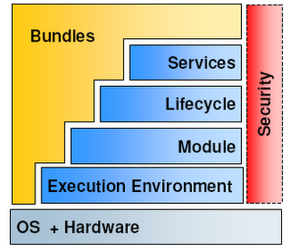
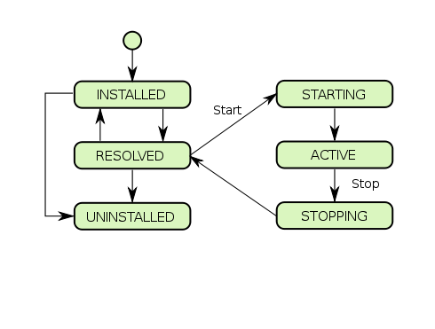

__Modularity in Java__
=======================
A quick __OSGI__ overview

---

About me
========

- Miguel Ángel Pastor Olivar
- Email: `miguelinlas3@gmail.com`
- Twitter handler: [miguelinlas3](http://twitter.com/miguelinlas3)
- [Personal blog](http://migue.github.com)
- Concurrency, high scalability, programming languages
- AspectJ, OSGI and Scala. Erlang aficionado.

---

Agenda
======

- Java's modularity limitations
- OSGI basics and benefits
- OSGI in practice
- Some advanced concepts
	- Components, frameworks and some more stuff
- Q & A

---

Java's modularity?
==================

- Code visibility control is __low level__ 
	- `private`, `protected`, `package`
- Java `classpath` is error prone
	- Prevent good modularity practices and hides tons of issues
	- They were not designed for app developers
- Lack of support for deployment and management

---

Modularize?? Really??
=====================

- Jars hell
- Have you ever worked with DLL??
- Logical structure of the applications
	- __Cohesion__: we should be driven by high cohesion
	- __Loosely coupling__ should be a must

---

Brief history
=============

- Open Service Gateway Initiatives
- Formed in March 1999
- "universal integration platform for the interoperability of applications and services."
	- Diversing programming API
	- Device capability
	- Suporting dynamic changes
	- Lightweight system

---

Enterprise OSGI
===============
- Embedded market was the initial target
- Gain popularity and maturity
	- Born OSGi Service Platform Enterprise Specification (Enterprise OSGi).
- Main features:
	- Management and configuration
	- Distribution
	- Data access

---

OSGI benefits
=============
- Large systems complexity: handle with it!
- Extensibility (no erosion)
- Lighweight
- Portability

---

OSGI basic architecture
=======================

---

OSGI module layer
=================

- OSGI module concept: `bundle`
- Basic elements of a `bundle`
	- Classes, Resources
	- Metadata (`manifest.mf`)
		- Human-readable information
		- Bundle identification
		- Code visibility
- Declare external dependencies on other packages

---

OSGI lifecycle layer
====================

- Defines how bundles are installed and managed

---

OSGI service layer
==================

- __SOA__ inside a __JVM__
- Publish, find and bind pattern
- Interface development approach
- CRC (Class Responsability Collaboration)

---

Quick tour
================
- OSGI bundles
- Bundle dependencies
- Running bundles
- OSGI Services and ServiceRegistry

---

Registry design pattern
=======================

- Find a service by its name or some attribute
- Consuming bundle, Registry service, Provider bundle 
- Consuming bundle searches the registry
- Consuming bundle doesn't know who provides the services or care how

---

Whiteboard design pattern
=========================

- Client to be called back when needed by an invoker bundle 
- Client bundle, registry, service, invoker bundle
- Client bundle registers a shared service in the registry and waits to be called
- Concerned only with implementing the callback interface

--- 

Deeper into modularity
======================

- Import your exports
- Implicit export attributes
- Mandatory attributes and directives
- Optional and dynamic imports
- Requiring bundles

---

Fragments
=========================

- Breaking a module into pieces
- Host bundle
- `Fragment-Host: org.foo.hostbundle; bundle-version="[a.b.c,d.e.f)"`
- Extends the bundle `classpath`
- Typical use cases:
	- I18N

---

Advanced concepts (I)
=====================

- Configuring my apps
	- Configuration Admin Service
- A world of events
	- The event admin
- Embedding OSGI on top JEE Server
- Remote services and cloud computing
- Interacting with JMX

---

Advanced concepts (II)
======================

- Components and frameworks
	- Declarative services
	- Blueprint (former Spring DM)
	- Apache Felix iPojo
- Web applications
	- OSGI Http service
	- Real use case: Liferay

---

Resources
=========

- [OSGI specification]()
- [OSGI in Action](http://www.manning.com/hall/)
- [OSGI in Depth](http://manning.com/alves/)
- [Java Application Architecture](http://www.amazon.com/Java-Application-Architecture-Modularity-Patterns/dp/0321247132)
- [Apache Felix](http://felix.apache.org/site/index.html)

---

Q & A
=====
